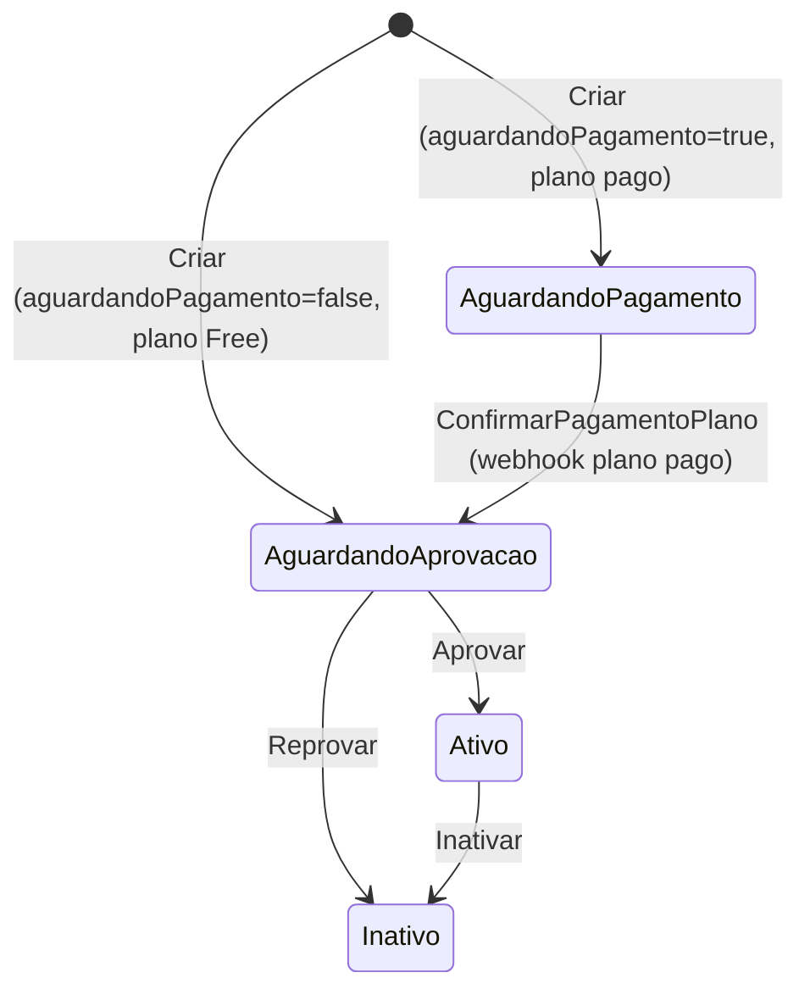
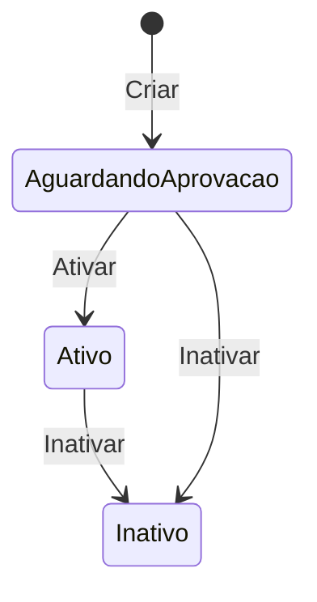
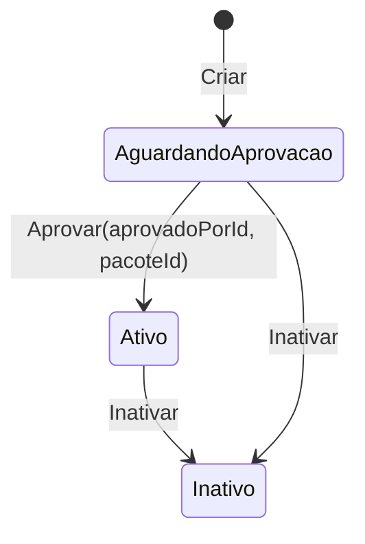
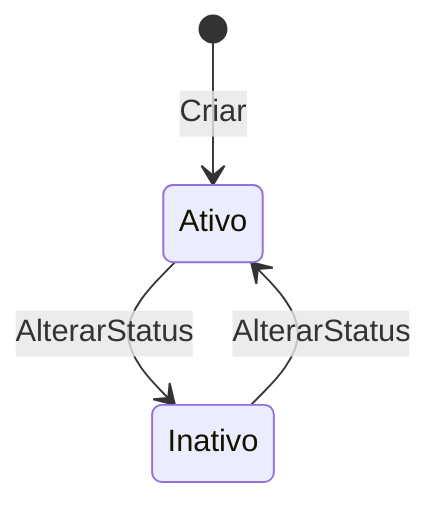

# specification-model — modelo de domínio (forzion.tech)

DOC PARA AGENTES. Fonte de verdade do modelo tático DDD (entidades, VOs, eventos, invariantes, máquinas de estado). Formato denso. Cross-ref: [specification-db] (persistência/colunas), [specification-backend] (handlers/use cases), [specification-stripe] (fluxo pagamento), [specification-email] (notificações).

## MANUTENÇÃO DESTE ARQUIVO
- Manter atualizado NA MESMA TAREFA de qualquer mudança em: entidade, factory, invariante, value object, enum, domain event, máquina de estado, exceção de domínio.
- NÃO duplicar estrutura de banco — referenciar [specification-db].

## 1. PRINCÍPIOS DDD
- **Factory `Criar(...)`**: toda entidade tem ctor privado vazio (`private X() { }`, p/ EF materializar) + factory estática pública que valida invariantes e gera `Id = Guid.NewGuid()`. Variações de nome: `LogAprovacao.Registrar`, `Conta.Criar(Email,...)`. Factories `internal` em sub-objetos de agregado (`SerieConfig.Criar`, `TreinoExercicio.Criar`, `ExecucaoExercicio.Criar`) — só criados via o aggregate root.
- **MODELO DE ERRO = Result pattern** (não exception): factory `Criar`/`Registrar` retorna `Result<T>`; métodos de mutação com invariante retornam `Result` (ou `Result<T>`). `Result`/`Result<T>`/`Error` vivem em `forzion.tech.Domain.Shared` (Domain não depende de Application). Catálogos de erro por agregado em `forzion.tech.Domain/Shared/Errors/*.cs` (`Error` com `code` estável `<agg>.<motivo>` + message pt-BR). Invariante violada → `Result.Failure(XErrors.Y)`. Sub-agregado retorna `Result<T>`; root propaga (`if (r.IsFailure) return Result.Failure<...>(r.Error!)`).
- **`Error(Code, Message, ErrorType=Business)`** — `ErrorType` {Business, Validation, NotFound, Conflict} discrimina a falha de negócio p/ mapeamento HTTP. Factories `Error.Business/Validation/NotFound/Conflict(code,msg)`. Tabela Type→HTTP é canônica em [specification-backend] (Api/`ResultExtensions`) — não reproduzida aqui.
- **Exception SÓ p/ infra/programação**: `ArgumentNullException.ThrowIfNull` (arg nulo = erro de programador) permanece exception. `DomainException`-derivadas de NÃO-invariante (lookup miss `*NaoEncontradoException`, authz `AcessoNegadoException`) são lançadas na Application/handler (control-flow), NÃO no domínio; mapeadas pelo `GlobalExceptionHandler` ([specification-backend]). O domínio NÃO lança `DomainException` para invariante de negócio.
- **Encapsulamento**: setters `private`; coleções expostas como `IReadOnlyList<>` sobre `List<>` privada (`Treino.Exercicios`, `TreinoExercicio.Series`, `ExecucaoTreino.Exercicios`). Mutação só via métodos do root.
- **Domain events**: `IDomainEvent { DateTime OcorridoEm }`. Entidades que emitem implementam `IHasDomainEvents { IReadOnlyList<IDomainEvent> DomainEvents; void ClearDomainEvents(); }` — acumulam em `List<IDomainEvent> _domainEvents`, despachados no `UnitOfWork.CommitAsync` (mecânica/re-entrância em [specification-backend]). Eventos são `sealed record`.
- **TimeProvider**: factories e métodos de transição recebem `DateTime agora` (injetado pela Application via `TimeProvider`) e o usam p/ `CreatedAt`/`UpdatedAt`/`DataInicio`/`OcorridoEm`. Sem `DateTime.UtcNow` no domínio (tokens derivam expiry de `agora`).

## 2. ENTIDADES
Linha por entidade: nome — propósito; factory; métodos de mutação; invariantes; eventos. `*` = implementa `IHasDomainEvents`. Colunas em [specification-db].

### Identidade & Auth
- **Conta*** — credenciais + tipo (raiz de identidade). `Criar(Email, passwordHash, TipoConta, agora)` → emite `ContaRegistradaEvent`; nasce `EmailVerificado=false`. Métodos: `AtualizarSenha(novoHash)`; `MarcarEmailVerificado(agora)` (idempotente: no-op se já verificado); `DefinirOptOutEngajamentoEmail(optOut, agora)` (seta flag de opt-out de e-mails de ENGAJAMENTO — não toca billing/transacional); `Anonimizar(agora)` (LGPD: idempotente — no-op se `AnonimizadaEm` já setado; troca Email por token `anon+{guid}@anonimizado.local`, zera PasswordHash, reset EmailVerificado/VerificadoEm, set `AnonimizadaEm`, emite `ContaAnonimizadaEvent`). Prop `AnonimizadaEm` (nullable); prop `NotificacoesEngajamentoEmailOptOut` (bool, default false — opt-out de e-mails de engajamento). Inv: passwordHash não-vazio; email não-nulo.
- **SystemUser** — perfil admin plataforma. `Criar(contaId, nome, agora, role=SuperAdmin)` → nasce `Status=Ativo`. Métodos: `AlterarRole`, `AlterarStatus`, `AtualizarNome`. Inv: contaId≠Empty; nome 1..100.
- **TokenRevogado** — blacklist JWT (logout). `Criar(jti, expiraEm, agora)` → `Result<TokenRevogado>`. Inv: jti≠Empty; expiraEm futuro (`expiraEm > agora`; sem `DateTime.UtcNow`, §1). PK=Jti. Sem mutação.
- **PasswordResetToken** — reset senha. `Criar(contaId, tokenHash, expiresAt, agora)`. `MarcarComoUsado(agora)` → `Result` (`TokenErrors.JaUtilizado` se já usado; NÃO lança). Inv: contaId≠Empty; hash não-vazio; expiresAt>agora.
- **RefreshTokenFamily** (aggregate root) — sessão de refresh (rotação). `Criar(contaId, absolutoExpiraEm, agora, rotulo?)`. `Revogar(motivo, agora)` → `Result` (`RefreshErrors.FamiliaJaRevogada` se já revogada). `EstaAtiva(agora)` = não-revogada ∧ `agora < AbsolutoExpiraEm`. Inv: contaId≠Empty; absoluto futuro. Motivo = `MotivoRevogacaoFamilia` (§4).
- **RefreshToken** — refresh single-use (cadeia de rotação). `Criar(familiaId, tokenHash, expiraEm, agora)`. `MarcarUsado(agora, sucessorId)` → `Result` (`RefreshErrors.TokenJaUtilizado`/`SucessorInvalido`). `EstaValido(agora)` = não-usado ∧ `agora < ExpiraEm`. Inv: familiaId≠Empty; hash não-vazio; expiraEm futuro. `UsadoEm` set ⇒ reuso = ataque (revoga família — [specification-security] §2).
- **EmailVerificationToken** — verificação e-mail no cadastro. `Criar(contaId, tokenHash, expiresAt, agora)`. `MarcarComoVerificado(agora)` → `Result` (`TokenErrors.JaUtilizado` se já usado; NÃO lança). Mesmas inv do reset token. Fluxo em [specification-email].
- **EmailDeliveryLog** — auditoria entrega (webhook Resend). `Criar(resendMessageId, eventType, recipientEmail, ocorridoEm, payload, agora)`. Sem validação/mutação (log append-only).
- **TrocaEmailToken** — confirmação de troca de e-mail (prova de posse do NOVO endereço). `Criar(contaId, novoEmail, tokenHash, expiraEm, agora)` → `Result`. `MarcarUsado(agora)` (single-use via `UsadoEm`). Inv: contaId≠Empty; novoEmail/hash não-vazios; expiraEm futuro. Fluxo (step-up + e-mail ao novo endereço) em [specification-email]/[specification-backend].

### MFA / 2FA (segundo fator)
Postura/fluxo em [specification-security] §2.1; colunas em [specification-db]. Nenhuma emite domain event. `agora` injetado (§1).
- **ContaMfa** — estado do TOTP por conta. `Criar(contaId, agora)`. Métodos: define/cifra segredo no enroll + `ConfirmarHabilitacao(agora)` (`Habilitado=true`); **anti-replay TOTP** — registra `UltimoTimeStep` e rejeita time-step `≤` ao último aceito (replay do mesmo código falha); `Desabilitar(agora)` (zera segredo + `UltimoTimeStep`, `Habilitado=false`). Inv: contaId≠Empty.
- **MfaRecoveryCode** — código de recuperação (single-use). `Criar(contaId, codigoHash, agora)` → `Result`. `MarcarUsado(agora)` (idempotência/single-use via `UsadoEm`). Inv: contaId≠Empty; hash não-vazio. Lote de 10 (`RecoveryCodeGenerator.Quantidade`); raw hex 10-char, SHA-256 em repouso.
- **MfaChallenge** — OTP de e-mail (login fallback / step-up). Const `MaximoTentativas=5`. `Criar(contaId, codigoHash, MfaProposito, expiraEm, agora)` → `Result`. `Expirado(agora)`; `Bloqueado` (= `Tentativas ≥ MaximoTentativas`); registra tentativa; `MarcarUsado`. Inv: contaId≠Empty; hash não-vazio.
- **TrustedDevice** — dispositivo confiável ("lembrar" pula o 2º fator). `Criar(contaId, tokenHash, expiraEm, agora, rotulo?)`. `EstaAtivo(agora)` = `!RevogadoEm && agora < ExpiraEm`; `Revogar(agora)`. Inv: contaId≠Empty; hash não-vazio. Token raw só no cookie httpOnly; `rotulo` = user-agent (PII).

### Treinador / Aluno / Vínculo
- **Treinador*** — perfil treinador (state machine própria). `Criar(contaId, nome, agora, telefone?=null)` → `Status=AguardandoAprovacao`. Métodos: `Aprovar(aprovadoPorId)` (→Ativo, set AprovadoPorId/Em, emite `TreinadorAprovadoEvent`); `Reprovar(reprovadoPorId)` (→Inativo, emite `TreinadorReprovadoEvent`); `Inativar(inativadoPorId?)` (→Inativo, emite `TreinadorInativadoEvent`); `AtribuirPlano(planoPlataformaId, agora)` → `Result` (retorna `Result.Failure(TreinadorErrors.PlanoTreinadorInativo)` se Inativo; NÃO lança); `AtualizarNome(nome)`; `AlterarModoPagamento(novoModo, agora)` → `Result`: falha `modo_inalterado` se igual ao atual; falha `cooldown_modo_pagamento` se `< CooldownModoPagamentoDias` (=90) desde `ModoPagamentoAlunoAlteradoEm`; senão set modo + `ModoPagamentoAlunoAlteradoEm=agora` (orquestração de cancelamento/criação de assinaturas é do handler — [specification-stripe]); guards `ValidarDisponibilidade()` (lança se ≠Ativo), `ValidarParaExclusao()` (só exclui se Inativo). Inv: nome 1..100; aprovar/reprovar só de AguardandoAprovacao. Const `CooldownModoPagamentoDias=90`. Prop `ModoPagamentoAlunoAlteradoEm` (nullable). `Anonimizar(agora)` idempotente via flag PERSISTIDA `Anonimizado` (scrub nome/telefone; no-op se já anonimizado — guard sobrevive ao reload do banco, [specification-db]).
- **Aluno*** — perfil aluno + anamnese. `Criar(contaId, nome, agora, email?, telefone?, diasDisponiveis?, tempoDisponivelMinutos?, finalidade?, focoTreino?, nivelCondicionamento?, limitacoesFisicas?, doencas?, observacoesAdicionais?)` → `Status=AguardandoAprovacao`; emite `AlunoRegistradoEvent(AlunoId, ContaId, Nome, Email?, agora)`. Métodos: `Atualizar(nome?, email?, telefone?)` (emite `AlunoAtualizadoEvent`); `Ativar()` (lança se já Ativo, SEM evento); `Inativar()` (emite `AlunoInativadoEvent`). `Email` é VO OPCIONAL (nasce null no cadastro; string vazia → null). Inv: nome 1..100; telefone ≤20. `Anonimizar(agora)` idempotente via flag PERSISTIDA `Anonimizado` (scrub PII+anamnese; no-op se já anonimizado — guard sobrevive ao reload do banco, [specification-db]).
- **VinculoTreinadorAluno*** — relação treinador↔aluno (aprovação + pacote). `Criar(treinadorId, alunoId, agora, pacoteId?=null)` → `Status=AguardandoAprovacao`, emite `VinculoPendenteCriadoEvent`. Métodos: `Aprovar(aprovadoPorId, pacoteId)` (→Ativo, set Pacote/AprovadoPor/Em/DataInicio, emite `VinculoAprovadoEvent`); `Inativar()` (→Inativo, set DataFim, SEM evento). Inv: ids≠Empty; aprovar só de AguardandoAprovacao; pacoteId≠Empty na aprovação.
- **ContaRecebimento** — Stripe Connect do treinador (onboarding state). `Criar(treinadorId, agora)` → `OnboardingCompleto=false`. Métodos: `ConfigurarStripeConnect(accountId)` (set account); `ConfirmarOnboarding()` (lança se sem account → `OnboardingCompleto=true`). Prop derivada `Configurada` (= account não-vazio). Sem eventos. Fluxo em [specification-stripe].

### Treino / Exercício / Execução
- **GrupoMuscular** — catálogo seedado. `Criar(nome, agora)`; `Atualizar(nome)`. Inv: nome 1..50. (Entidade ≠ enum `TipoGrupoMuscular`, §4.)
- **Exercicio** — global (`TreinadorId=null`) ou do treinador. `Criar(nome, grupoMuscularId, agora, treinadorId?=null, descricao?, comoExecutar?, videoUrl?)`; `Atualizar(nome?, grupoMuscularId?, descricao?, agora, comoExecutar?, videoUrl?)`. Prop derivada `IsGlobal` (= TreinadorId null). Inv: nome 1..100; grupoMuscularId≠Empty; descricao ≤500; comoExecutar ≤2000 (>2000 → `ExercicioErrors.ComoExecutarMuitoLongo`); videoUrl parseada por `YouTubeVideoId` (§3) → persiste `VideoId` (11ch) ou falha. PATCH parcial (null=mantém, string vazia=limpa) p/ descricao/comoExecutar/videoUrl — orientação reutilizável herdada na cópia global→treinador (`CopiarExercicioGlobalHandler`).
- **Treino** (aggregate root) — ficha de treino + exercícios ordenados. `Criar(nome, objetivo, treinadorId, agora, dificuldade=Iniciante, dataInicio?, dataFim?)`. Métodos: `Atualizar(nome?, objetivo?, dificuldade?, dataInicio?, dataFim?, limparDataInicio, limparDataFim)`; `AdicionarExercicio(exercicioId)` (cria `TreinoExercicio` ordem=count+1); `RemoverExercicio(treinoExercicioId)` (remove + reordena); `Duplicar(agora)` (cópia mesmo treinador, nome+" (cópia)"); `DuplicarPara(novoTreinadorId, agora)` (clona p/ outro treinador, mantém nome); guard estático `ValidarMutabilidade(bool foiExecutado)` (lança `TreinoExecutadoException`; gateia TODA mutação de ficha já executada — incluindo `Atualizar` de cabeçalho nome/objetivo/dificuldade/datas, além de adicionar/remover/editar exercício e excluir). `foiExecutado` = resultado de `IExecucaoTreinoRepository.ExisteParaTreinoComAlunoAtivoAsync` — retorna `true` somente se existe execução E o `TreinoAluno` do aluno executor está `Ativo`; aluno inativado/desvinculado (`TreinoAlunoStatus.Inativo`) NÃO trava — treino volta a ser mutável. Inv: nome 1..100; treinadorId≠Empty; dataFim≥dataInicio. `Atualizar` valida invariantes ANTES de mutar (validate-then-mutate; falha não deixa estado parcial). Sem eventos.
- **TreinoExercicio** (filho de Treino) — exercício na ficha + séries. Factory `internal Criar(treinoId, exercicioId, ordem)`. Métodos: `AdicionarSerie(...)` (ordem=count+1); `AtualizarSeries(lista)` (≥1 grupo, recria); `AtualizarObservacao(obs?)` (≤500); `internal AlterarOrdem(int)`. Inv: ids≠Empty.
- **SerieConfig** (filho de TreinoExercicio) — config de séries. Factory `internal Criar(treinoExercicioId, quantidade, repeticoesMin, repeticoesMax?, descricao?, carga?, descanso?, ordem)`. Inv: quantidade≥1; repeticoesMin≥1; repeticoesMax≥min; carga≥0; descanso≥0. Sem mutação.
- **TreinoAluno*** — atribuição de ficha a aluno. `Criar(treinoId, alunoId, agora)` → `Status=Ativo`, emite `TreinoDisponibilizadoEvent(AlunoId, TreinoId, TreinoAlunoId)`. `AlterarStatus(status, agora)` (SEM evento). Inv: ids≠Empty.
- **ExecucaoTreino*** (aggregate root) — sessão executada pelo aluno. `Criar(treinoId, alunoId, dataExecucao, agora, observacao?, idempotencyKey?)` → emite `ExecucaoRegistradaEvent(AlunoId, TreinoId, ExecucaoTreinoId)`. `AdicionarExercicio(treinoExercicioId, seriesExecutadas, repeticoesExecutadas, cargaExecutada?, observacao?)` (cria filho via factory internal). Inv: ids≠Empty; dataExecucao≠default; obs ≤500.
- **ExecucaoExercicio** (filho de ExecucaoTreino) — detalhe por exercício. Factory `internal Criar(...)`. Inv: ids≠Empty; series≥1; repeticoes≥1; carga≥0; obs ≤500.

### Billing / Pagamento (agregado rico)
- **PlanoPlataforma** — planos de assinatura do treinador↔plataforma; implementa `ICapacidadePlano` (§8). `Criar(nome, tier, maxAlunos, preco, agora, descricao?)` → `IsAtivo=true`. Métodos: `Atualizar(nome?, tier?, maxAlunos?, preco?, descricao?)`; `Ativar()`; `Inativar()`. Inv: nome 1..100; maxAlunos>0; preco≥0.
- **Pacote** — serviço oferecido pelo treinador. `Criar(treinadorId, nome, preco, agora, descricao?)` → `IsAtivo=true`. `Atualizar(nome?, preco?, descricao?)`; `Inativar()`. Inv: treinadorId≠Empty; nome 1..100; preco≥0; descricao ≤500.
- **AssinaturaAluno*** — assinatura recorrente (state machine + contador de falhas). Const `LimiteTentativasFalhas = 3`. `Criar(vinculoId, pacoteId, treinadorId, alunoId, valor, agora)` → `Status=Pendente`, `DataInicio=DataProximaCobranca=agora`, emite `AssinaturaAlunoCriadaEvent`. Métodos:
  - `Ativar()` — →Ativa (lança se Cancelada). SEM evento.
  - `MarcarInadimplente()` — →Inadimplente (lança se ≠Ativa). SEM evento (manual; transição automática usa `RegistrarPagamentoFalho`).
  - `Cancelar(agora)` — →Cancelada, set DataCancelamento, emite `AssinaturaAlunoCanceladaEvent` (lança se já Cancelada).
  - `AgendarProximaCobranca(data, agora)` — set DataProximaCobranca (data deve ser futura). SEM evento.
  - `RegistrarPagamentoFalho(agora)` — Cancelada→no-op; senão incrementa `TentativasFalhasConsecutivas`, SEMPRE emite `PagamentoFalhouEvent`; se contador≥3 E Status=Ativa → Inadimplente + emite `AssinaturaAlunoMarcadaInadimplenteEvent`.
  - `MarcarInadimplentePorDisputa(agora)` — só de Ativa (else no-op idempotente): →Inadimplente imediato, equipara contador a 3, emite `AssinaturaAlunoMarcadaInadimplenteEvent`. (Chargeback congela acesso sem esperar threshold.)
  - `RegistrarPagamentoRegularizado(agora)` — Cancelada→no-op; zera contador; se Inadimplente→Ativa (reativa) emite `AssinaturaAlunoReativadaEvent` (G-PAY-3: só na transição efetiva Inadimplente→Ativa). Idempotente (2ª chamada já Ativa = sem evento).
- **Pagamento*** — cobrança da assinatura (state machine). `Criar(assinaturaId, valor, agora, metodo=Pix)` → `Status=Pendente`, emite `PagamentoCriadoEvent`. Métodos:
  - `DefinirDadosPix(paymentIntentId, qrCode, qrCodeUrl, expiracao, agora)` / `DefinirDadosCartao(paymentIntentId, clientSecret, agora)` — set dados Stripe (validam não-vazio). SEM evento.
  - `MarcarPago()` — só de Pendente, set DataPagamento. SEM evento (⚠️ regularização da assinatura é orquestrada na Application, não cascateia daqui).
  - `MarcarFalhou()` / `MarcarExpirado()` — só de Pendente. SEM evento.
  - `MarcarEstornado()` — só de Pago (`charge.refunded`), DataPagamento preservada, emite `PagamentoEstornadoEvent`.
  - `MarcarEmDisputa(motivoDisputa)` — só de Pago (`charge.dispute.created`), DataPagamento preservada, motivo default "unknown", emite `PagamentoEmDisputaEvent`.
  - Inv: valor>0; transições guardadas por status.

### Billing treinador↔plataforma (assinatura do treinador ao seu plano)
- **AssinaturaTreinador*** — assinatura recorrente treinador→plataforma (state machine + contador + plano agendado). Const `LimiteTentativasFalhas=3`. `Criar(treinadorId, planoPlataformaId, valor, agora)` → `Status=Pendente`, `DataInicio=DataProximaCobranca=agora`, emite `AssinaturaTreinadorCriadaEvent`. Inv (factory): treinadorId/planoId≠Empty; valor>0. **Invariante global: ≤1 assinatura não-cancelada por treinador** (garantida pelo índice único parcial `ux_assinaturas_treinador_nao_cancelada_por_treinador` — AD-002, [specification-db]); 23505 em `Criar` durante corrida → handler re-busca vencedor. Métodos (todos retornam `Result` salvo nota; `agora` injetado):
  - `Ativar(agora)` — →Ativa (falha se Cancelada; falha se Inadimplente → deve usar regularização). SEM evento.
  - `MarcarInadimplente(agora)` — só de Ativa. SEM evento (manual; automático via `RegistrarPagamentoFalho`).
  - `Cancelar(agora)` — →Cancelada, set DataCancelamento, emite `AssinaturaTreinadorCanceladaEvent` (falha se já Cancelada).
  - `AgendarProximaCobranca(data, agora)` — data futura. SEM evento.
  - `RegistrarPagamentoFalho(agora)` — `void`. Cancelada→no-op; incrementa contador; SEMPRE emite `AssinaturaTreinadorPagamentoFalhouEvent`; se contador≥3 E Ativa → Inadimplente + emite `AssinaturaTreinadorMarcadaInadimplenteEvent` (paridade com `AssinaturaAluno`).
  - `MarcarInadimplentePorDisputa(agora)` — só de Ativa (T4); no-op idempotente se já Inadimplente/outro status não-Ativa. →Inadimplente imediato, equipara contador a `LimiteTentativasFalhas`. SEM evento distinto (congelamento por chargeback/estorno; paridade com `AssinaturaAluno.MarcarInadimplentePorDisputa`). Chamado pelo handler `ProcessarEstornoTreinadorAsync` e `ProcessarDisputaTreinadorAsync`.
  - `RegistrarPagamentoRegularizado(agora)` — `void`. Cancelada→no-op; zera contador; se Inadimplente→Ativa emite `AssinaturaTreinadorReativadaEvent`. Idempotente.
  - `TrocarPlanoImediato(novoPlanoId, novoValor, agora)` — só de Ativa/Inadimplente; set plano+valor, limpa plano agendado, emite `AssinaturaTreinadorPlanoTrocadoEvent(…, PlanoAnteriorId, PlanoNovoId, …)`. (Usado em upgrade/regularização.)
  - `AgendarDowngrade(novoPlanoId, agora)` — só de Ativa; set `PlanoPlataformaIdAgendado` (aplicado na próxima renovação). SEM evento.
  - `LimparPlanoAgendado(agora)` — `void`. Zera plano agendado (no-op se já null).
  - `AplicarPlanoAgendado(novoValor, agora)` — se sem plano agendado → `Result.Success` no-op; senão promove agendado→atual, limpa, emite `AssinaturaTreinadorPlanoTrocadoEvent`.
  - Props: `PlanoPlataformaIdAgendado` (nullable, downgrade pendente). Status enum `AssinaturaTreinadorStatus` (§4).
- **PagamentoTreinador*** — cobrança do plano do treinador (PaymentIntent direto-plataforma, SEM Connect; ver [specification-stripe]). `Criar(treinadorId, assinaturaTreinadorId, valor, FinalidadePagamentoTreinador, agora, metodo=Pix, planoAlvoId?=null)` → `Status=Pendente`. Inv (factory): ids≠Empty; valor>0. Métodos:
  - `DefinirDadosPix(paymentIntentId, qrCode, qrCodeUrl, expiracao, agora)` / `DefinirDadosCartao(paymentIntentId, clientSecret, agora)` — set dados Stripe (validam não-vazio). SEM evento.
  - `MarcarPago(agora)` — só de Pendente, set DataPagamento, emite `PagamentoTreinadorPagoEvent(…, Finalidade, PlanoAlvoId, …)` (handler orquestra renovação/troca — [specification-backend]).
  - `MarcarFalhou(agora)` / `MarcarExpirado(agora)` — só de Pendente. SEM evento.
  - `MarcarEstornado(agora)` — só de Pago (T4). SEM evento. Handler `ProcessarEstornoTreinadorAsync` chama adicionalmente `AssinaturaTreinador.MarcarInadimplentePorDisputa` para congelar acesso.
  - `MarcarEmDisputa(agora)` — só de Pago (T4). SEM evento. Handler `ProcessarDisputaTreinadorAsync` idem.
  - Props: `Finalidade` (Cadastro/Renovacao/TrocaPlano/Contratacao), `PlanoAlvoId` (nullable, plano da troca). Reusa `PagamentoStatus`/`MetodoPagamento`. Máquina de estado: Pendente → Pago/Falhou/Expirado; Pago → Estornado/EmDisputa (terminais).

### Projeção / Observabilidade
- **Assinante** — read model derivado de Aluno (sync via domain events; ver [specification-db]). `Criar(alunoId, nome, email?, agora)` (sem validação); `Sincronizar(nome, email?)`. Sem eventos.
- **HealthReportConfig** — config runtime do relatório diário de saúde. `Criar(ativo, horaEnvioUtc, destinatarios, incluirLiveness, incluirKpis, incluirEntregabilidade, incluirErros, agora)`; `Atualizar(...)` (mesmos args); `MarcarEnviado(agora)`; `ObterDestinatarios()` (split CSV). Inv: destinatários normalizados via `Email.Criar` (lowercase, dedup); config ativa exige ≥1 destinatário.
- **HealthSnapshot** — snapshot diário de saúde. `Criar(ambiente, status, payloadJson, agora)`. Inv: ambiente/payload não-vazios. Append-only.
- **ErrorLogEntry** — log de ERROR/Critical. Const `MensagemMaxLength=4000`. `Criar(ocorridoEm, nivel, origem, mensagem)` (trunca mensagem em 4000). Inv: nivel/origem não-vazios. Append-only.
- **LogAprovacao** — auditoria de aprovações/inativações. Factory `Registrar(tipoAcao, realizadoPorId, entidadeId, entidadeTipo, agora, observacao?)`. Inv: ids≠Empty; entidadeTipo não-vazio; obs ≤500. Append-only.
- **Notificacao** — item do feed in-app de notificações (destinatário = `Conta`; feature notificacoes-engajamento-treino). `Criar(destinatarioContaId, TipoNotificacao, titulo, corpo, agora, linkRelativo?, diaReferencia?)` → `Result<Notificacao>`. Consts implícitas: titulo 1..120, corpo 1..500 (ambos `Trim()`; erros `NotificacaoErrors.{DestinatarioInvalido,TituloObrigatorio,TituloMuitoLongo,CorpoObrigatorio,CorpoMuitoLongo}`, todos `Validation`). `MarcarLida(agora)` (idempotente: no-op se já `Lida`; senão set `Lida`+`UpdatedAt`). Props: `DiaReferencia` (`DateOnly?`, dedup do dia no scan de engajamento), `LinkRelativo` (`string?`), `Lida`, `UpdatedAt`. NÃO emite domain event (NÃO é `IHasDomainEvents`). Idempotência do scan garantida por índice único PARCIAL `(DestinatarioContaId, Tipo, DiaReferencia)` WHERE `dia_referencia IS NOT NULL` — 23505 tratado como no-op no repo ([specification-db], [specification-backend]).
- **MensagemSuporte*** — ticket de contato com o suporte. `Criar(contaId, categoria, assunto, descricao, agora)` → `Result<MensagemSuporte>`. Consts `AssuntoMaxLength=120`, `DescricaoMaxLength=2000`. Inv: contaId≠Empty; categoria definida; assunto 3..120; descrição 20..2000. Emite `MensagemSuporteCriadaEvent`. NÃO armazena nome/e-mail (identidade resolvida live no handler). Apagada na anonimização LGPD ([specification-lgpd]).

## 3. VALUE OBJECTS
- **Email** — `sealed record`, `string Value`. `Criar(value)` → `Result<Email>` (NÃO lança): normaliza (`Trim().ToLowerInvariant()`), valida ≤256 + regex `^[^@\s]+@[^@\s]+\.[^@\s]+$` (Compiled+IgnoreCase+NonBacktracking, timeout 1s); falha → `Result.Failure` com `EmailErrors.Obrigatorio` (vazio) / `EmailErrors.MuitoLongo` (>256) / `EmailErrors.Invalido` (regex). `FromDatabase(value)`: BYPASSA validação (reconstituição de dados já persistidos). `ToString()`=Value. Igualdade/imutabilidade via `record`.
- **YouTubeVideoId** — `sealed record`, `string Value` (11 chars). `Criar(urlOuId)` → `Result<YouTubeVideoId>` (NÃO lança): `Trim()`, aceita ID puro (`^[A-Za-z0-9_-]{11}$`, Compiled+NonBacktracking) OU extrai de URL (`watch?v=`/`youtu.be/`/`shorts/`/`embed/`) via regex com lookahead-boundary (Compiled+IgnoreCase, SEM NonBacktracking — lookaround é incompatível; padrão linear sem ReDoS); ignora query extra; lixo → `Result.Failure(ExercicioErrors.VideoUrlInvalida)`. `FromDatabase(value)`: bypassa. Persiste SÓ o id de 11 chars (host descartado) — embed sempre forçado a `youtube-nocookie.com` no frontend, defense-in-depth (re-valida no backend E no `lib/utils/youtube.ts`).

## 4. ENUMS
Significado/transições de domínio (mapeamento de coluna em [specification-db]).
- **TipoConta** {SystemAdmin, Treinador, Aluno} — discrimina raiz de identidade (1 Conta : 1 perfil).
- **SystemRole** {SuperAdmin, Support, Operator} — nível de acesso admin plataforma.
- **UsuarioStatus** {Ativo, Inativo} — ciclo de SystemUser.
- **TreinadorStatus** {AguardandoAprovacao, Ativo, Inativo, AguardandoPagamento} — §6. `AguardandoPagamento`: cadastro aprovado mas plano pago pendente (gateia login → `TreinadorPagamentoPendenteException`; `IniciarPagamentoPlano` exige este status).
- **AlunoStatus** {AguardandoAprovacao, Ativo, Inativo} — §6.
- **VinculoStatus** {AguardandoAprovacao, Ativo, Inativo} — §6.
- **TierPlano** {Free, Basic, Pro, ProPlus, Elite} — faixa do plano de plataforma. **`TierPlanoExtensions`** (Domain/Enums): `PermiteEmail()` → tier≥Pro; `PermiteWhatsApp()` → tier≥ProPlus. Free/Basic/sem-plano = só notificação na plataforma. Elite **indisponível**: `AtribuirPlanoHandler` rejeita tier=Elite com `PlanoPlataformaErrors.EliteIndisponivel`.
- **TreinoAlunoStatus** {Ativo, Inativo} — §6 (1 atribuição Ativa por treino, ver [specification-db]).
- **ObjetivoTreino** {Hipertrofia, Forca, Resistencia, Emagrecimento, Reabilitacao} — objetivo da ficha.
- **DificuldadeTreino** {Iniciante, Intermediario, Avancado} — nível da ficha (default Iniciante).
- **FinalidadeTreino** {Hipertrofia, Emagrecimento, CondicionamentoFisico, Saude, PerformanceEsportiva, Reabilitacao, Outro} — finalidade do aluno (anamnese).
- **NivelCondicionamento** {Sedentario, Iniciante, Intermediario, Avancado} — condicionamento do aluno.
- **TempoDisponivel** {TrintaMinutos=30, QuarentaCincoMinutos=45, UmaHora=60, UmaHoraETrinta=90, DuasHoras=120} — minutos/sessão do aluno (valor int = minutos).
- **AssinaturaAlunoStatus** {Pendente, Ativa, Inadimplente, Cancelada} — §6.
- **PagamentoStatus** {Pendente, Pago, Expirado, Falhou, Estornado, EmDisputa} — §6. EmDisputa só transiciona de Pago.
- **MetodoPagamento** {Pix, Cartao} — método da cobrança (default Pix).
- **ModoPagamentoAluno** {Plataforma, Externo} (default Plataforma) — como o treinador cobra seus alunos (via plataforma/Stripe Connect ou por fora).
- **AssinaturaTreinadorStatus** {Pendente, Ativa, Inadimplente, Cancelada} — ciclo da assinatura treinador→plataforma (mesma forma de `AssinaturaAlunoStatus`; máquina em §6).
- **FinalidadePagamentoTreinador** {Cadastro=0, Renovacao=1, TrocaPlano=2, Contratacao=3} — discrimina o que o `PagamentoTreinador` cobra; o handler do `PagamentoTreinadorPagoEvent` ramifica por este valor; `Contratacao` early-returns no handler (ativação inline em `FinalizarContratacaoAsync` no webhook — [specification-stripe]).
- **TipoAcaoAprovacao** {AprovacaoTreinador, ReprovacaoTreinador, InativacaoTreinador, AprovacaoVinculo, ReprovacaoVinculo, InativacaoVinculo, AtribuicaoPlanTreinador, ExclusaoTreinador, ExportacaoDados, AnonimizacaoConta, ConsentimentoAnamnese} — tipo registrado em LogAprovacao (ExportacaoDados/AnonimizacaoConta/ConsentimentoAnamnese = trilha LGPD; ConsentimentoAnamnese = consentimento art. 11 no cadastro do aluno, observacao = versão do termo). Persistido como text (`HasConversion<string>`) → novo valor sem migration.
- **StatusSaude** {Ok, Degradado, Falha} — status geral do HealthSnapshot.
- **CategoriaSuporte** {Duvida=0, Sugestao=1, Outro=2} — categoria do ticket de `MensagemSuporte`. Persistido como text (`HasConversion<string>`).
- **TipoNotificacao** {NovoTreino, ExecucaoRegistrada, Reforco, LembreteLeve, Recuperacao, MarcoStreak, DigestTreinador} — tipo do item de `Notificacao`. `NovoTreino`/`ExecucaoRegistrada` = disparados por domain event; `Reforco`/`LembreteLeve`/`Recuperacao`/`MarcoStreak` = nudges do scan de aderência do aluno; `DigestTreinador` = resumo diário ao treinador. Persistido como text (`HasConversion<string>`). Nudges Reforco/LembreteLeve/Recuperacao são MUTUAMENTE EXCLUSIVOS por dia; MarcoStreak coexiste só com Reforco (lógica em [specification-backend]).
- **MotivoRevogacaoFamilia** {Logout=0, TrocaSenha=1, ReuseDetectado=2, MfaDesabilitado=3, Admin=4, TrocaEmail=5} — motivo da revogação de `RefreshTokenFamily`. Persistido como text(32). `TrocaSenha` usado em alterar/redefinir senha; `TrocaEmail` na confirmação de troca de e-mail ([specification-email]). `MfaDesabilitado` ainda RESERVADO (sem uso atual). Cross-ref [specification-security] §2.
- **MfaFator** {Totp=0, Email=1, RecoveryCode=2} — fator usado na verificação do 2º passo do login MFA ([specification-security] §2.1).
- **MfaProposito** {LoginFallback=0, StepUp=1} — finalidade do `MfaChallenge` (OTP de e-mail): conclusão de login pendente vs. reautenticação step-up. Persistido como text(32).
- **TipoGrupoMuscular** {Peito, Costas, Ombro, Biceps, Triceps, Pernas, Gluteos, Core, FullBody} — ⚠️ enum no namespace Enums chamado `TipoGrupoMuscular` (não `GrupoMuscular`); a entidade catálogo é `GrupoMuscular`. Usado p/ seed dos 9 grupos; não é coluna ([specification-db]).

## 5. DOMAIN EVENTS
Todos `sealed record : IDomainEvent`. Handlers (e-mail/WhatsApp/projeção) em [specification-email]/[specification-stripe]/[specification-backend] — NÃO re-listados aqui.

| Evento | Emitido por | Payload | Efeito (handler) |
|--------|-------------|---------|------------------|
| ContaRegistradaEvent | Conta.Criar | ContaId, Email, OcorridoEm | e-mail verificação ([specification-email]) |
| TreinoDisponibilizadoEvent | TreinoAluno.Criar | AlunoId, TreinoId, TreinoAlunoId, OcorridoEm | in-app ao aluno (TODOS os tiers) + e-mail (gate ≥Pro + opt-out) + WhatsApp (gate ≥ProPlus + opt-out) ([specification-email]/[specification-whatsapp]) |
| ExecucaoRegistradaEvent | ExecucaoTreino.Criar | AlunoId, TreinoId, ExecucaoTreinoId, OcorridoEm | in-app ao treinador do vínculo ativo do aluno (hot path NOTIF-07: 1 insert, sem I/O externa — [specification-backend]/[specification-performance]) |
| ContaAnonimizadaEvent | Conta.Anonimizar | ContaId, TipoConta, OcorridoEm | trilha LGPD (anonimização efetiva) |
| AlunoRegistradoEvent | Aluno.Criar | AlunoId, ContaId, Nome, Email?, OcorridoEm | e-mail BemVindoAluno + sync Assinante |
| AlunoAtualizadoEvent | Aluno.Atualizar | AlunoId, Nome, Email?, OcorridoEm | sync read model Assinante |
| AlunoInativadoEvent | Aluno.Inativar | AlunoId, OcorridoEm | e-mail AlunoInativado |
| TreinadorAprovadoEvent | Treinador.Aprovar | TreinadorId, AprovadoPorId, OcorridoEm | e-mail TreinadorAprovado |
| TreinadorReprovadoEvent | Treinador.Reprovar | TreinadorId, ReprovadoPorId, OcorridoEm | e-mail TreinadorReprovado |
| TreinadorInativadoEvent | Treinador.Inativar | TreinadorId, InativadoPorId, OcorridoEm | e-mail TreinadorInativado |
| VinculoPendenteCriadoEvent | VinculoTreinadorAluno (criação AguardandoAprovacao) | VinculoId, TreinadorId, AlunoId, OcorridoEm | notifica treinador de aluno pendente (e-mail + WhatsApp) |
| VinculoAprovadoEvent | VinculoTreinadorAluno.Aprovar | VinculoId, TreinadorId, AlunoId, AprovadoPorId, OcorridoEm | e-mail VinculoAprovado |
| AssinaturaAlunoCriadaEvent | AssinaturaAluno.Criar | AssinaturaAlunoId, TreinadorId, AlunoId, PacoteId, Valor, OcorridoEm | e-mail AssinaturaAlunoCriada |
| AssinaturaAlunoCanceladaEvent | AssinaturaAluno.Cancelar | AssinaturaAlunoId, AlunoId, TreinadorId, Valor, OcorridoEm | notifica aluno + treinador |
| AssinaturaAlunoMarcadaInadimplenteEvent | AssinaturaAluno.RegistrarPagamentoFalho (cruza limite) / MarcarInadimplentePorDisputa | AssinaturaAlunoId, AlunoId, TreinadorId, TentativasFalhasConsecutivas, OcorridoEm | notifica + bloqueia consumo ([specification-stripe]) |
| AssinaturaAlunoReativadaEvent | AssinaturaAluno.RegistrarPagamentoRegularizado (Inadimplente→Ativa) | AssinaturaAlunoId, AlunoId, TreinadorId, OcorridoEm | notifica aluno + treinador (regularização) |
| PagamentoCriadoEvent | Pagamento.Criar | PagamentoId, AssinaturaAlunoId, Valor, MetodoPagamento, OcorridoEm | e-mail/WhatsApp CobrancaDisponivel |
| PagamentoFalhouEvent | AssinaturaAluno.RegistrarPagamentoFalho | AssinaturaAlunoId, AlunoId, TentativasFalhasConsecutivas, OcorridoEm | notificação progressiva (1/2+/3+) |
| PagamentoEstornadoEvent | Pagamento.MarcarEstornado | PagamentoId, AssinaturaAlunoId, Valor, OcorridoEm | e-mail aluno (não cascateia cancelamento) |
| PagamentoEmDisputaEvent | Pagamento.MarcarEmDisputa | PagamentoId, AssinaturaAlunoId, Valor, MotivoDisputa, OcorridoEm | e-mail URGENTE treinador + log Critical |
| AssinaturaTreinadorCriadaEvent | AssinaturaTreinador.Criar | AssinaturaTreinadorId, TreinadorId, PlanoPlataformaId, Valor, OcorridoEm | (sem handler registrado — ver [specification-backend]) |
| AssinaturaTreinadorCanceladaEvent | AssinaturaTreinador.Cancelar | AssinaturaTreinadorId, TreinadorId, OcorridoEm | (sem handler registrado) |
| AssinaturaTreinadorPagamentoFalhouEvent | AssinaturaTreinador.RegistrarPagamentoFalho (toda tentativa) | AssinaturaTreinadorId, TreinadorId, TentativasFalhasConsecutivas, OcorridoEm | e-mail treinador (progressivo 1/2/3+) — `AssinaturaTreinadorPagamentoFalhouEmailHandler` |
| AssinaturaTreinadorMarcadaInadimplenteEvent | AssinaturaTreinador.RegistrarPagamentoFalho (cruza limite) | AssinaturaTreinadorId, TreinadorId, TentativasFalhasConsecutivas, OcorridoEm | e-mail treinador — `AssinaturaTreinadorMarcadaInadimplenteEmailHandler` |
| AssinaturaTreinadorReativadaEvent | AssinaturaTreinador.RegistrarPagamentoRegularizado (Inadimplente→Ativa) | AssinaturaTreinadorId, TreinadorId, OcorridoEm | (sem handler registrado) |
| AssinaturaTreinadorPlanoTrocadoEvent | AssinaturaTreinador.TrocarPlanoImediato / AplicarPlanoAgendado | AssinaturaTreinadorId, TreinadorId, PlanoAnteriorId, PlanoNovoId, OcorridoEm | (sem handler registrado) |
| PagamentoTreinadorPagoEvent | PagamentoTreinador.MarcarPago | PagamentoTreinadorId, TreinadorId, AssinaturaTreinadorId, Finalidade, PlanoAlvoId?, OcorridoEm | orquestra renovação/troca de plano ([specification-backend]) |
| MensagemSuporteCriadaEvent | MensagemSuporte.Criar | MensagemSuporteId, ContaId, TipoConta, Categoria, Assunto, Descricao, OcorridoEm | e-mail ao suporte (handler DURÁVEL via outbox, [specification-email]) |
| CobrancaProximaAlunoEvent | (dispatch por `DespacharPreAvisosAlunoHandler`) | AssinaturaAlunoId, AlunoId, TreinadorId, Valor, DataProximaCobranca, OcorridoEm | e-mail pré-aviso aluno (3 dias antes; `CobrancaProximaEmailAlunoHandler`) |
| CobrancaProximaTreinadorEvent | (dispatch por `DespacharPreAvisosTreinadorHandler`) | AssinaturaTreinadorId, TreinadorId, Valor, DataProximaCobranca, OcorridoEm | e-mail pré-aviso treinador (3 dias antes; `CobrancaProximaEmailTreinadorHandler`) |

⚠️ `PagamentoFalhouEvent` carrega `AssinaturaAlunoId` (1º campo) e é emitido pela `AssinaturaAluno`, NÃO pelo `Pagamento`. `PagamentoCriadoEvent`/`PagamentoEstornadoEvent`/`PagamentoEmDisputaEvent` são emitidos pelo `Pagamento`.
⚠️ `AssinaturaTreinadorPagamentoFalhouEvent` é emitido a CADA falha (análogo ao `PagamentoFalhouEvent` do aluno). Na 3ª falha, `AssinaturaTreinadorMarcadaInadimplenteEvent` é emitido ADICIONALMENTE (dois eventos no mesmo `RegistrarPagamentoFalho`). Ambos têm handler de e-mail registrado.
⚠️ `AssinaturaTreinadorCriadaEvent`, `AssinaturaTreinadorCanceladaEvent`, `AssinaturaTreinadorReativadaEvent`, `AssinaturaTreinadorPlanoTrocadoEvent` — sem handler registrado. Só `PagamentoTreinadorPagoEvent` tem handler de orquestração.

## 6. MÁQUINAS DE ESTADO
Trigger = método. `[*]` = factory.


**Fluxo de cadastro do treinador PAGO** (orquestração end-to-end; gate Free vs pago em `TierPlanoExtensions`/[specification-stripe]):
1. `Treinador.Criar(... planoPlataformaId, modoPagamentoAluno, aguardandoPagamento=true)` → `Status=AguardandoPagamento`; `AssinaturaTreinador.Criar(Pendente)`; **`ContaRegistradaEvent` NÃO disparado ainda** (verificação de e-mail adiada até o pagamento — `Conta` criada sem `EmitirRegistro`). Login bloqueado por `TreinadorPagamentoPendenteException`.
2. Treinador paga o plano (`IniciarPagamentoPlanoHandler`, finalidade `Cadastro`) → PaymentIntent direto-plataforma ([specification-stripe]).
3. Webhook `payment_intent.succeeded` (`tipo=plano_treinador`) → `PagamentoTreinador.MarcarPago` + **finalização ATÔMICA inline** (mesmo commit, `FinalizarCadastroAsync`): `AssinaturaTreinador.Ativar` + `AgendarProximaCobranca(+1mês)` + `Treinador.ConfirmarPagamentoPlano` (→AguardandoAprovacao) + `Conta.EmitirRegistro` (dispara `ContaRegistradaEvent` → e-mail de verificação adiado).
4. Treinador verifica e-mail → admin `Aprovar` → `Status=Ativo` (libera login/app).
- **Free** (`TierPlano.Free` ou sem plano pago): `Criar(aguardandoPagamento=false)` pula passos 1-3; nasce `AguardandoAprovacao` com `ContaRegistradaEvent` imediato; segue verificação→aprovação direto.



```mermaid
stateDiagram-v2
  %% AssinaturaAluno
  [*] --> Pendente : Criar
  Pendente --> Ativa : Ativar
  Ativa --> Inadimplente : RegistrarPagamentoFalho (contador>=3)
  Ativa --> Inadimplente : MarcarInadimplente / MarcarInadimplentePorDisputa
  Inadimplente --> Ativa : RegistrarPagamentoRegularizado
  Pendente --> Cancelada : Cancelar
  Ativa --> Cancelada : Cancelar
  Inadimplente --> Cancelada : Cancelar
  note right of Cancelada : terminal; RegistrarPagamentoFalho/Regularizado = no-op
```

```mermaid
stateDiagram-v2
  %% AssinaturaTreinador (Ativar falha se Inadimplente — usar regularização)
  [*] --> Pendente : Criar
  Pendente --> Ativa : Ativar
  Ativa --> Inadimplente : RegistrarPagamentoFalho (contador>=3) / MarcarInadimplente / MarcarInadimplentePorDisputa
  Inadimplente --> Ativa : RegistrarPagamentoRegularizado
  Pendente --> Cancelada : Cancelar
  Ativa --> Cancelada : Cancelar
  Inadimplente --> Cancelada : Cancelar
  note right of Cancelada : terminal; RegistrarPagamentoFalho/Regularizado = no-op
```

```mermaid
stateDiagram-v2
  %% Pagamento
  [*] --> Pendente : Criar
  Pendente --> Pago : MarcarPago
  Pendente --> Falhou : MarcarFalhou
  Pendente --> Expirado : MarcarExpirado
  Pago --> Estornado : MarcarEstornado
  Pago --> EmDisputa : MarcarEmDisputa
  note right of Estornado : terminais; demais transições lançam DomainException
```

## 7. EXCEÇÕES DE DOMÍNIO
Base `DomainException : Exception` (ctors: vazio / message / message+inner). `DomainException` cru (invariante) → **422**; as derivadas abaixo dão semântica de caso de uso (lançadas majoritariamente na Application) e VÁRIAS mapeiam p/ status ≠422 (401/403/404/409). **Mapa exceção→status HTTP é canônico em [specification-backend] §4** (`GlobalExceptionHandler`) — não reproduzir códigos por linha aqui.

| Exceção | Quando |
|---------|--------|
| AcessoNegado | ação fora da autorização do usuário |
| CredenciaisInvalidas | login: e-mail/senha inválidos (não vaza qual) |
| EmailJaCadastrado | cadastro com e-mail já existente |
| EmailNaoVerificado | login antes de verificar e-mail (const `Codigo="EMAIL_NAO_VERIFICADO"` — ver [specification-email]) |
| TreinadorAguardandoAprovacao | login de treinador ainda em análise (const `Codigo="TREINADOR_AGUARDANDO_APROVACAO"`) |
| TreinadorInativo | login de treinador inativo (const `Codigo="TREINADOR_INATIVO"`) |
| TreinadorPagamentoPendente | login de treinador `AguardandoPagamento` (const `Codigo="TREINADOR_PAGAMENTO_PENDENTE"`) |
| AlunoInativo | operação sobre aluno inativo |
| AlunoJaVinculado | criar vínculo p/ aluno já com vínculo ativo em outro treinador |
| AlunoNaoEncontrado | lookup de aluno falhou |
| TreinadorNaoEncontrado | lookup de treinador falhou |
| VinculoNaoEncontrado | lookup de vínculo falhou |
| PacoteNaoEncontrado | lookup de pacote falhou |
| PlanoPlataformaNaoEncontrado | lookup de plano falhou |
| ExercicioNaoEncontrado | lookup de exercício falhou |
| GrupoMuscularNaoEncontrado | lookup de grupo muscular falhou |
| TreinoNaoEncontrado | lookup de treino falhou |
| LimiteAlunosAtingido | treinador no limite de alunos do plano (`ICapacidadePlano.MaxAlunos`) |
| TreinoExecutado | tentativa de alterar treino executado por aluno ativo (via `Treino.ValidarMutabilidade`) |

## 8. INTERFACES DE DOMÍNIO
- **IDomainEvent** (Events) — `DateTime OcorridoEm`. Contrato base de evento.
- **IHasDomainEvents** (Events) — `IReadOnlyList<IDomainEvent> DomainEvents; void ClearDomainEvents();`. Implementado por: Conta (emite `ContaRegistradaEvent` + `ContaAnonimizadaEvent`), Aluno, Treinador, VinculoTreinadorAluno, AssinaturaAluno, Pagamento, AssinaturaTreinador, PagamentoTreinador, MensagemSuporte, TreinoAluno (emite `TreinoDisponibilizadoEvent`), ExecucaoTreino (emite `ExecucaoRegistradaEvent`).
- **ICapacidadePlano** (Interfaces) — `int MaxAlunos`. Implementado por `PlanoPlataforma`; abstrai a regra de capacidade usada na validação de `LimiteAlunosAtingidoException`.
