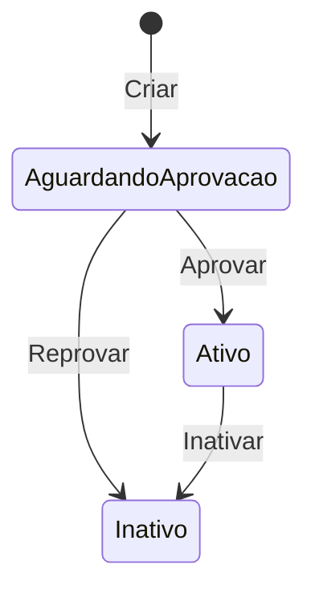
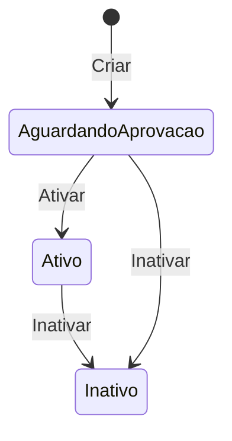
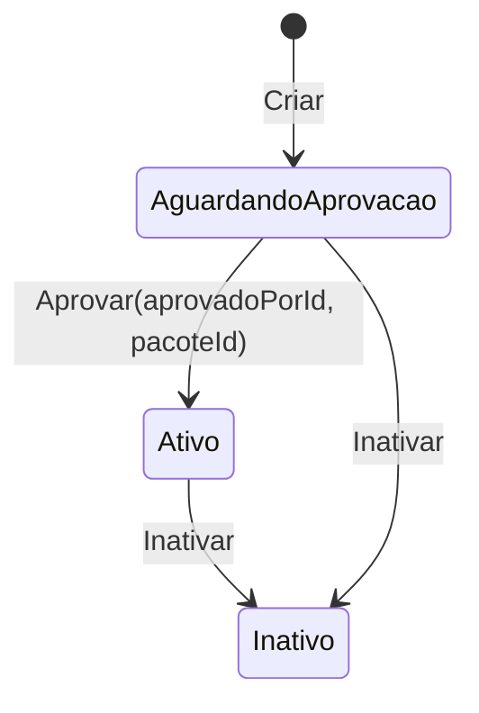
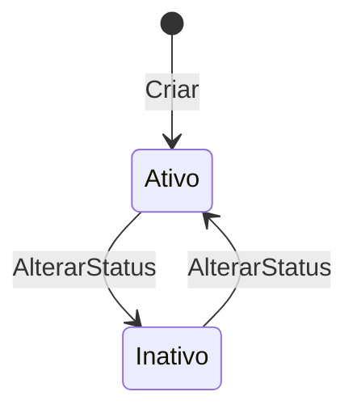

# specification-model — modelo de domínio (forzion.tech)

DOC PARA AGENTES. Fonte de verdade do modelo tático DDD (entidades, VOs, eventos, invariantes, máquinas de estado). Formato denso. Cross-ref: [specification-db] (persistência/colunas), [specification-backend] (handlers/use cases), [specification-stripe] (fluxo pagamento), [specification-email] (notificações).

## MANUTENÇÃO DESTE ARQUIVO
- Manter atualizado NA MESMA TAREFA de qualquer mudança em: entidade, factory, invariante, value object, enum, domain event, máquina de estado, exceção de domínio.
- Vive em `specs/` (versionado; commitar). NÃO duplicar estrutura de banco — referenciar [specification-db].

## 1. PRINCÍPIOS DDD
- **Factory `Criar(...)`**: toda entidade tem ctor privado vazio (`private X() { }`, p/ EF materializar) + factory estática pública que valida invariantes e gera `Id = Guid.NewGuid()`. Variações de nome: `LogAprovacao.Registrar`, `Conta.Criar(Email,...)`. Factories `internal` em sub-objetos de agregado (`SerieConfig.Criar`, `TreinoExercicio.Criar`, `ExecucaoExercicio.Criar`) — só criados via o aggregate root.
- **MODELO DE ERRO = Result pattern** (não exception): factory `Criar`/`Registrar` retorna `Result<T>`; métodos de mutação com invariante retornam `Result` (ou `Result<T>`). `Result`/`Result<T>`/`Error(Code,Message)` vivem em `forzion.tech.Domain.Shared` (Domain não depende de Application). Catálogos de erro por agregado em `forzion.tech.Domain/Shared/Errors/*.cs` (`Error` com `code` estável `<agg>.<motivo>` + message pt-BR). Invariante violada → `Result.Failure(XErrors.Y)`. Sub-agregado retorna `Result<T>`; root propaga (`if (r.IsFailure) return Result.Failure<...>(r.Error!)`).
- **Exception SÓ p/ infra/programação**: `ArgumentNullException.ThrowIfNull` (arg nulo = erro de programador) permanece exception. `DomainException`-derivadas de NÃO-invariante (lookup miss `*NaoEncontradoException`, authz `AcessoNegadoException`) são lançadas na Application/handler (control-flow), NÃO no domínio; mapeadas pelo `GlobalExceptionHandler` ([specification-backend]). O domínio NÃO lança `DomainException` para invariante de negócio.
- **Encapsulamento**: setters `private`; coleções expostas como `IReadOnlyList<>` sobre `List<>` privada (`Treino.Exercicios`, `TreinoExercicio.Series`, `ExecucaoTreino.Exercicios`). Mutação só via métodos do root.
- **Domain events**: `IDomainEvent { DateTime OcorridoEm }`. Entidades que emitem implementam `IHasDomainEvents { IReadOnlyList<IDomainEvent> DomainEvents; void ClearDomainEvents(); }` — acumulam em `List<IDomainEvent> _domainEvents`, despachados no `UnitOfWork.CommitAsync` (mecânica/re-entrância em [specification-backend]). Eventos são `sealed record`.
- **TimeProvider**: factories e métodos de transição recebem `DateTime agora` (injetado pela Application via `TimeProvider`) e o usam p/ `CreatedAt`/`UpdatedAt`/`DataInicio`/`OcorridoEm`. Sem `DateTime.UtcNow` no domínio (tokens derivam expiry de `agora`).

## 2. ENTIDADES
Linha por entidade: nome — propósito; factory; métodos de mutação; invariantes; eventos. `*` = implementa `IHasDomainEvents`. Colunas em [specification-db].

### Identidade & Auth
- **Conta*** — credenciais + tipo (raiz de identidade). `Criar(Email, passwordHash, TipoConta, agora)` → emite `ContaRegistradaEvent`; nasce `EmailVerificado=false`. Métodos: `AtualizarSenha(novoHash)`; `MarcarEmailVerificado(agora)` (idempotente: no-op se já verificado). Inv: passwordHash não-vazio; email não-nulo.
- **SystemUser** — perfil admin plataforma. `Criar(contaId, nome, agora, role=SuperAdmin)` → nasce `Status=Ativo`. Métodos: `AlterarRole`, `AlterarStatus`, `AtualizarNome`. Inv: contaId≠Empty; nome 1..100.
- **TokenRevogado** — blacklist JWT (logout). `Criar(jti, expiraEm)`. Inv: jti≠Empty; expiraEm futuro (`> DateTime.UtcNow`). PK=Jti. Sem mutação.
- **PasswordResetToken** — reset senha. `Criar(contaId, tokenHash, expiresAt, agora)`. `MarcarComoUsado(agora)` (lança se já usado). Inv: contaId≠Empty; hash não-vazio; expiresAt>agora.
- **EmailVerificationToken** — verificação e-mail no cadastro. `Criar(contaId, tokenHash, expiresAt, agora)`. `MarcarComoVerificado(agora)` (lança se já usado). Mesmas inv do reset token. Fluxo em [specification-email].
- **EmailDeliveryLog** — auditoria entrega (webhook Resend). `Criar(resendMessageId, eventType, recipientEmail, ocorridoEm, payload, agora)`. Sem validação/mutação (log append-only).

### Treinador / Aluno / Vínculo
- **Treinador*** — perfil treinador (state machine própria). `Criar(contaId, nome, agora, telefone?=null)` → `Status=AguardandoAprovacao`. Métodos: `Aprovar(aprovadoPorId)` (→Ativo, set AprovadoPorId/Em, emite `TreinadorAprovadoEvent`); `Reprovar(reprovadoPorId)` (→Inativo, emite `TreinadorReprovadoEvent`); `Inativar(inativadoPorId?)` (→Inativo, emite `TreinadorInativadoEvent`); `AtribuirPlano(planoPlataformaId)` (lança se Inativo); `AtualizarNome(nome)`; guards `ValidarDisponibilidade()` (lança se ≠Ativo), `ValidarParaExclusao()` (só exclui se Inativo). Inv: nome 1..100; aprovar/reprovar só de AguardandoAprovacao.
- **Aluno*** — perfil aluno + anamnese. `Criar(contaId, nome, agora, email?, telefone?, diasDisponiveis?, tempoDisponivelMinutos?, finalidade?, focoTreino?, nivelCondicionamento?, limitacoesFisicas?, doencas?, observacoesAdicionais?)` → `Status=AguardandoAprovacao`; emite `AlunoRegistradoEvent(AlunoId, ContaId, Nome, Email?, agora)`. Métodos: `Atualizar(nome?, email?, telefone?)` (emite `AlunoAtualizadoEvent`); `Ativar()` (lança se já Ativo, SEM evento); `Inativar()` (emite `AlunoInativadoEvent`). `Email` é VO OPCIONAL (nasce null no cadastro; string vazia → null). Inv: nome 1..100; telefone ≤20.
- **VinculoTreinadorAluno*** — relação treinador↔aluno (aprovação + pacote). `Criar(treinadorId, alunoId, agora, pacoteId?=null)` → `Status=AguardandoAprovacao`. Métodos: `Aprovar(aprovadoPorId, pacoteId)` (→Ativo, set Pacote/AprovadoPor/Em/DataInicio, emite `VinculoAprovadoEvent`); `Inativar()` (→Inativo, set DataFim, SEM evento). Inv: ids≠Empty; aprovar só de AguardandoAprovacao; pacoteId≠Empty na aprovação.
- **ContaRecebimento** — Stripe Connect do treinador (onboarding state). `Criar(treinadorId, agora)` → `OnboardingCompleto=false`. Métodos: `ConfigurarStripeConnect(accountId)` (set account); `ConfirmarOnboarding()` (lança se sem account → `OnboardingCompleto=true`). Prop derivada `Configurada` (= account não-vazio). Sem eventos. Fluxo em [specification-stripe].

### Treino / Exercício / Execução
- **GrupoMuscular** — catálogo seedado. `Criar(nome, agora)`; `Atualizar(nome)`. Inv: nome 1..50. (Entidade ≠ enum `TipoGrupoMuscular`, §4.)
- **Exercicio** — global (`TreinadorId=null`) ou do treinador. `Criar(nome, grupoMuscularId, agora, treinadorId?=null, descricao?)`; `Atualizar(nome?, grupoMuscularId?, descricao?)`. Prop derivada `IsGlobal` (= TreinadorId null). Inv: nome 1..100; grupoMuscularId≠Empty; descricao ≤500.
- **Treino** (aggregate root) — ficha de treino + exercícios ordenados. `Criar(nome, objetivo, treinadorId, agora, dificuldade=Iniciante, dataInicio?, dataFim?)`. Métodos: `Atualizar(nome?, objetivo?, dificuldade?, dataInicio?, dataFim?, limparDataInicio, limparDataFim)`; `AdicionarExercicio(exercicioId)` (cria `TreinoExercicio` ordem=count+1); `RemoverExercicio(treinoExercicioId)` (remove + reordena); `Duplicar(agora)` (cópia mesmo treinador, nome+" (cópia)"); `DuplicarPara(novoTreinadorId, agora)` (clona p/ outro treinador, mantém nome); guard estático `ValidarMutabilidade(bool foiExecutado)` (lança `TreinoExecutadoException`). Inv: nome 1..100; treinadorId≠Empty; dataFim≥dataInicio. Sem eventos.
- **TreinoExercicio** (filho de Treino) — exercício na ficha + séries. Factory `internal Criar(treinoId, exercicioId, ordem)`. Métodos: `AdicionarSerie(...)` (ordem=count+1); `AtualizarSeries(lista)` (≥1 grupo, recria); `AtualizarObservacao(obs?)` (≤500); `internal AlterarOrdem(int)`. Inv: ids≠Empty.
- **SerieConfig** (filho de TreinoExercicio) — config de séries. Factory `internal Criar(treinoExercicioId, quantidade, repeticoesMin, repeticoesMax?, descricao?, carga?, descanso?, ordem)`. Inv: quantidade≥1; repeticoesMin≥1; repeticoesMax≥min; carga≥0; descanso≥0. Sem mutação.
- **TreinoAluno** — atribuição de ficha a aluno. `Criar(treinoId, alunoId, agora)` → `Status=Ativo`. `AlterarStatus(status)`. Inv: ids≠Empty. Sem eventos.
- **ExecucaoTreino** (aggregate root) — sessão executada pelo aluno. `Criar(treinoId, alunoId, dataExecucao, agora, observacao?)`. `AdicionarExercicio(treinoExercicioId, seriesExecutadas, repeticoesExecutadas, cargaExecutada?, observacao?)` (cria filho via factory internal). Inv: ids≠Empty; dataExecucao≠default; obs ≤500. Sem eventos.
- **ExecucaoExercicio** (filho de ExecucaoTreino) — detalhe por exercício. Factory `internal Criar(...)`. Inv: ids≠Empty; series≥1; repeticoes≥1; carga≥0; obs ≤500.

### Billing / Pagamento (agregado rico)
- **PlanoPlataforma** — planos de assinatura do treinador↔plataforma; implementa `ICapacidadePlano` (§8). `Criar(nome, tier, maxAlunos, preco, agora, descricao?)` → `IsAtivo=true`. Métodos: `Atualizar(nome?, tier?, maxAlunos?, preco?, descricao?)`; `Ativar()`; `Inativar()`. Inv: nome 1..100; maxAlunos>0; preco≥0.
- **Pacote** — serviço oferecido pelo treinador. `Criar(treinadorId, nome, preco, agora, descricao?)` → `IsAtivo=true`. `Atualizar(nome?, preco?, descricao?)`; `Inativar()`. Inv: treinadorId≠Empty; nome 1..100; preco≥0; descricao ≤500.
- **AssinaturaAluno*** — assinatura recorrente (state machine + contador de falhas). Const `LimiteTentativasFalhas = 3`. `Criar(vinculoId, pacoteId, treinadorId, alunoId, valor, agora)` → `Status=Pendente`, `DataInicio=DataProximaCobranca=agora`, emite `AssinaturaAlunoCriadaEvent`. Métodos:
  - `Ativar()` — →Ativa (lança se Cancelada). SEM evento.
  - `MarcarInadimplente()` — →Inadimplente (lança se ≠Ativa). SEM evento (manual; transição automática usa `RegistrarPagamentoFalho`).
  - `Cancelar(agora)` — →Cancelada, set DataCancelamento, emite `AssinaturaAlunoCanceladaEvent` (lança se já Cancelada).
  - `AgendarProximaCobranca(data, agora)` — set DataProximaCobranca (data deve ser futura). SEM evento.
  - `RegistrarPagamentoFalho(agora)` — Cancelada→no-op; senão incrementa `TentativasFalhasConsecutivas`, SEMPRE emite `PagamentoFalhouEvent`; se contador≥3 E Status=Ativa → Inadimplente + emite `AssinaturaAlunoMarcadaInadimplenteEvent`.
  - `MarcarInadimplentePorDisputa(agora)` — só de Ativa (else no-op idempotente): →Inadimplente imediato, equipara contador a 3, emite `AssinaturaAlunoMarcadaInadimplenteEvent`. (Chargeback congela acesso sem esperar threshold.)
  - `RegistrarPagamentoRegularizado(agora)` — Cancelada→no-op; zera contador; se Inadimplente→Ativa (reativa). Idempotente.
- **Pagamento*** — cobrança da assinatura (state machine). `Criar(assinaturaId, valor, agora, metodo=Pix)` → `Status=Pendente`, emite `PagamentoCriadoEvent`. Métodos:
  - `DefinirDadosPix(paymentIntentId, qrCode, qrCodeUrl, expiracao)` / `DefinirDadosCartao(paymentIntentId, clientSecret)` — set dados Stripe (validam não-vazio). SEM evento.
  - `MarcarPago()` — só de Pendente, set DataPagamento. SEM evento (⚠️ regularização da assinatura é orquestrada na Application, não cascateia daqui).
  - `MarcarFalhou()` / `MarcarExpirado()` — só de Pendente. SEM evento.
  - `MarcarEstornado()` — só de Pago (`charge.refunded`), DataPagamento preservada, emite `PagamentoEstornadoEvent`.
  - `MarcarEmDisputa(motivoDisputa)` — só de Pago (`charge.dispute.created`), DataPagamento preservada, motivo default "unknown", emite `PagamentoEmDisputaEvent`.
  - Inv: valor>0; transições guardadas por status.

### Projeção / Observabilidade
- **Assinante** — read model derivado de Aluno (sync via domain events; ver [specification-db]). `Criar(alunoId, nome, email?, agora)` (sem validação); `Sincronizar(nome, email?)`. Sem eventos.
- **HealthReportConfig** — config runtime do relatório diário de saúde. `Criar(ativo, horaEnvioUtc, destinatarios, incluirLiveness, incluirKpis, incluirEntregabilidade, incluirErros, agora)`; `Atualizar(...)` (mesmos args); `MarcarEnviado(agora)`; `ObterDestinatarios()` (split CSV). Inv: destinatários normalizados via `Email.Criar` (lowercase, dedup); config ativa exige ≥1 destinatário.
- **HealthSnapshot** — snapshot diário de saúde. `Criar(ambiente, status, payloadJson, agora)`. Inv: ambiente/payload não-vazios. Append-only.
- **ErrorLogEntry** — log de ERROR/Critical. Const `MensagemMaxLength=4000`. `Criar(ocorridoEm, nivel, origem, mensagem)` (trunca mensagem em 4000). Inv: nivel/origem não-vazios. Append-only.
- **LogAprovacao** — auditoria de aprovações/inativações. Factory `Registrar(tipoAcao, realizadoPorId, entidadeId, entidadeTipo, agora, observacao?)`. Inv: ids≠Empty; entidadeTipo não-vazio; obs ≤500. Append-only.

## 3. VALUE OBJECTS
- **Email** (único VO) — `sealed record`, `string Value`. `Criar(value)`: normaliza (`Trim().ToLowerInvariant()`), valida ≤256 + regex `^[^@\s]+@[^@\s]+\.[^@\s]+$` (Compiled+IgnoreCase+NonBacktracking, timeout 1s); inválido → `DomainException`. `FromDatabase(value)`: BYPASSA validação (reconstituição de dados já persistidos). `ToString()`=Value. Igualdade/imutabilidade via `record`.

## 4. ENUMS
Significado/transições de domínio (mapeamento de coluna em [specification-db]).
- **TipoConta** {SystemAdmin, Treinador, Aluno} — discrimina raiz de identidade (1 Conta : 1 perfil).
- **SystemRole** {SuperAdmin, Support, Operator} — nível de acesso admin plataforma.
- **UsuarioStatus** {Ativo, Inativo} — ciclo de SystemUser.
- **TreinadorStatus** {AguardandoAprovacao, Ativo, Inativo} — §6.
- **AlunoStatus** {AguardandoAprovacao, Ativo, Inativo} — §6.
- **VinculoStatus** {AguardandoAprovacao, Ativo, Inativo} — §6.
- **TierPlano** {Free, Basic, Pro, ProPlus, Elite} — faixa do plano de plataforma. **`TierPlanoExtensions`** (Domain/Enums): `PermiteEmail()` → tier≥Pro; `PermiteWhatsApp()` → tier≥ProPlus. Free/Basic/sem-plano = só notificação na plataforma. Elite **indisponível**: `AtribuirPlanoHandler` rejeita tier=Elite com `PlanoPlataformaErrors.EliteIndisponivel`.
- **TreinoAlunoStatus** {Ativo, Inativo} — §6 (1 atribuição Ativa por treino, ver [specification-db]).
- **ObjetivoTreino** {Hipertrofia, Forca, Resistencia, Emagrecimento, Reabilitacao} — objetivo da ficha.
- **DificuldadeTreino** {Iniciante, Intermediario, Avancado} — nível da ficha (default Iniciante).
- **FinalidadeTreino** {Hipertrofia, Emagrecimento, CondicionamentoFisico, Saude, PerformanceEsportiva, Reabilitacao, Outro} — finalidade do aluno (anamnese).
- **NivelCondicionamento** {Sedentario, Iniciante, Intermediario, Avancado} — condicionamento do aluno.
- **TempoDisponivel** {TrintaMinutos=30, QuarentaCincoMinutos=45, UmaHora=60, UmaHoraETrinta=90, DuasHoras=120} — minutos/sessão do aluno (valor int = minutos).
- **AssinaturaAlunoStatus** {Pendente, Ativa, Inadimplente, Cancelada} — §6.
- **PagamentoStatus** {Pendente, Pago, Expirado, Falhou, Estornado, EmDisputa} — §6. EmDisputa só transiciona de Pago.
- **MetodoPagamento** {Pix, Cartao} — método da cobrança (default Pix).
- **TipoAcaoAprovacao** {AprovacaoTreinador, ReprovacaoTreinador, InativacaoTreinador, AprovacaoVinculo, ReprovacaoVinculo, InativacaoVinculo, AtribuicaoPlanTreinador} — tipo registrado em LogAprovacao.
- **StatusSaude** {Ok, Degradado, Falha} — status geral do HealthSnapshot.
- **TipoGrupoMuscular** {Peito, Costas, Ombro, Biceps, Triceps, Pernas, Gluteos, Core, FullBody} — ⚠️ enum no namespace Enums chamado `TipoGrupoMuscular` (não `GrupoMuscular`); a entidade catálogo é `GrupoMuscular`. Usado p/ seed dos 9 grupos; não é coluna ([specification-db]).

## 5. DOMAIN EVENTS
Todos `sealed record : IDomainEvent`. Handlers (e-mail/WhatsApp/projeção) em [specification-email]/[specification-stripe]/[specification-backend] — NÃO re-listados aqui.

| Evento | Emitido por | Payload | Efeito (handler) |
|--------|-------------|---------|------------------|
| ContaRegistradaEvent | Conta.Criar | ContaId, Email, OcorridoEm | e-mail verificação ([specification-email]) |
| AlunoRegistradoEvent | Aluno.Criar | AlunoId, ContaId, Nome, Email?, OcorridoEm | e-mail BemVindoAluno + sync Assinante |
| AlunoAtualizadoEvent | Aluno.Atualizar | AlunoId, Nome, Email?, OcorridoEm | sync read model Assinante |
| AlunoInativadoEvent | Aluno.Inativar | AlunoId, OcorridoEm | e-mail AlunoInativado |
| TreinadorAprovadoEvent | Treinador.Aprovar | TreinadorId, AprovadoPorId, OcorridoEm | e-mail TreinadorAprovado |
| TreinadorReprovadoEvent | Treinador.Reprovar | TreinadorId, ReprovadoPorId, OcorridoEm | e-mail TreinadorReprovado |
| TreinadorInativadoEvent | Treinador.Inativar | TreinadorId, InativadoPorId, OcorridoEm | e-mail TreinadorInativado |
| VinculoAprovadoEvent | VinculoTreinadorAluno.Aprovar | VinculoId, TreinadorId, AlunoId, AprovadoPorId, OcorridoEm | e-mail VinculoAprovado |
| AssinaturaAlunoCriadaEvent | AssinaturaAluno.Criar | AssinaturaAlunoId, TreinadorId, AlunoId, PacoteId, Valor, OcorridoEm | e-mail AssinaturaAlunoCriada |
| AssinaturaAlunoCanceladaEvent | AssinaturaAluno.Cancelar | AssinaturaAlunoId, AlunoId, TreinadorId, Valor, OcorridoEm | notifica aluno + treinador |
| AssinaturaAlunoMarcadaInadimplenteEvent | AssinaturaAluno.RegistrarPagamentoFalho (cruza limite) / MarcarInadimplentePorDisputa | AssinaturaAlunoId, AlunoId, TreinadorId, TentativasFalhasConsecutivas, OcorridoEm | notifica + bloqueia consumo ([specification-stripe]) |
| PagamentoCriadoEvent | Pagamento.Criar | PagamentoId, AssinaturaAlunoId, Valor, MetodoPagamento, OcorridoEm | e-mail/WhatsApp CobrancaDisponivel |
| PagamentoFalhouEvent | AssinaturaAluno.RegistrarPagamentoFalho | AssinaturaAlunoId, AlunoId, TentativasFalhasConsecutivas, OcorridoEm | notificação progressiva (1/2+/3+) |
| PagamentoEstornadoEvent | Pagamento.MarcarEstornado | PagamentoId, AssinaturaAlunoId, Valor, OcorridoEm | e-mail aluno (não cascateia cancelamento) |
| PagamentoEmDisputaEvent | Pagamento.MarcarEmDisputa | PagamentoId, AssinaturaAlunoId, Valor, MotivoDisputa, OcorridoEm | e-mail URGENTE treinador + log Critical |

⚠️ `PagamentoFalhouEvent` carrega `AssinaturaAlunoId` (1º campo) e é emitido pela `AssinaturaAluno`, NÃO pelo `Pagamento`. `PagamentoCriadoEvent`/`PagamentoEstornadoEvent`/`PagamentoEmDisputaEvent` são emitidos pelo `Pagamento`.

## 6. MÁQUINAS DE ESTADO
Trigger = método. `[*]` = factory.





```mermaid
stateDiagram-v2
  %% AssinaturaAluno
  [*] --> Pendente : Criar
  Pendente --> Ativa : Ativar
  Ativa --> Inadimplente : RegistrarPagamentoFalho (contador>=3)
  Ativa --> Inadimplente : MarcarInadimplente / MarcarInadimplentePorDisputa
  Inadimplente --> Ativa : RegistrarPagamentoRegularizado
  Pendente --> Cancelada : Cancelar
  Ativa --> Cancelada : Cancelar
  Inadimplente --> Cancelada : Cancelar
  note right of Cancelada : terminal; RegistrarPagamentoFalho/Regularizado = no-op
```

```mermaid
stateDiagram-v2
  %% Pagamento
  [*] --> Pendente : Criar
  Pendente --> Pago : MarcarPago
  Pendente --> Falhou : MarcarFalhou
  Pendente --> Expirado : MarcarExpirado
  Pago --> Estornado : MarcarEstornado
  Pago --> EmDisputa : MarcarEmDisputa
  note right of Estornado : terminais; demais transições lançam DomainException
```


## 7. EXCEÇÕES DE DOMÍNIO
Base `DomainException : Exception` (ctors: vazio / message / message+inner). Toda derivada → HTTP **422** no `GlobalExceptionHandler` ([specification-backend]); só `ValidationException` (FluentValidation) → 400. Factories/métodos lançam `DomainException` cru para invariantes; as derivadas abaixo dão semântica de caso de uso (lançadas majoritariamente na Application).

| Exceção | Quando |
|---------|--------|
| AcessoNegado | ação fora da autorização do usuário |
| CredenciaisInvalidas | login: e-mail/senha inválidos (não vaza qual) |
| EmailJaCadastrado | cadastro com e-mail já existente |
| EmailNaoVerificado | login antes de verificar e-mail (const `Codigo="EMAIL_NAO_VERIFICADO"`, 403 — ver [specification-email]) |
| AlunoInativo | operação sobre aluno inativo |
| AlunoJaVinculado | criar vínculo p/ aluno já com vínculo ativo em outro treinador |
| AlunoNaoEncontrado | lookup de aluno falhou |
| TreinadorNaoEncontrado | lookup de treinador falhou |
| VinculoNaoEncontrado | lookup de vínculo falhou |
| PacoteNaoEncontrado | lookup de pacote falhou |
| PlanoPlataformaNaoEncontrado | lookup de plano falhou |
| ExercicioNaoEncontrado | lookup de exercício falhou |
| GrupoMuscularNaoEncontrado | lookup de grupo muscular falhou |
| TreinoNaoEncontrado | lookup de treino falhou |
| LimiteAlunosAtingido | treinador no limite de alunos do plano (`ICapacidadePlano.MaxAlunos`) |
| TreinoExecutado | tentativa de alterar treino já executado (via `Treino.ValidarMutabilidade`) |

## 8. INTERFACES DE DOMÍNIO
- **IDomainEvent** (Events) — `DateTime OcorridoEm`. Contrato base de evento.
- **IHasDomainEvents** (Events) — `IReadOnlyList<IDomainEvent> DomainEvents; void ClearDomainEvents();`. Implementado por: Conta, Aluno, Treinador, VinculoTreinadorAluno, AssinaturaAluno, Pagamento.
- **ICapacidadePlano** (Interfaces) — `int MaxAlunos`. Implementado por `PlanoPlataforma`; abstrai a regra de capacidade usada na validação de `LimiteAlunosAtingidoException`.
